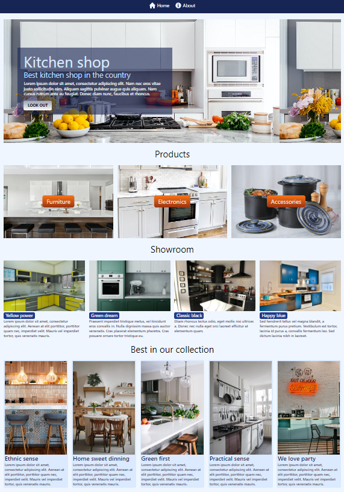

# 🔪 Kitchen shop

It is a fictional kitchen shop created with Vue and Tailwind.css.
_Project contains only one styled page._

## 🛠️ Technologies
   

- Vue
- Typescript
- Tailwind.css
- Eslint

## ⚙️ Scripts

To run the project locally:

``
npm run dev
``

## 🖥️ Preview

## Sources
Free photos are from [Unsplash](https://unsplash.com/)
